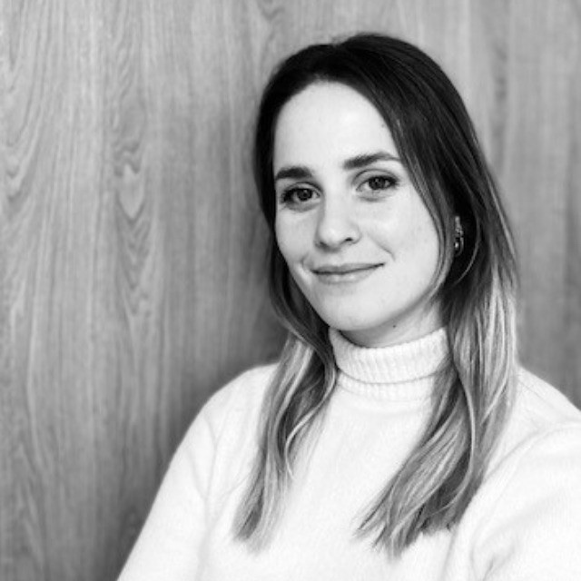

<html lang="fr">
<head>
    <meta charset="UTF-8">
    <meta name="viewport" content="width=device-width, initial-scale=1.0">
    <title>Candidature Webdesigner - Clara</title>
    <link rel="icon" href="icone.png" type="image/png">
    
</head>
<body>
    <header>
        <h1>Clara — Webdesigner & UX Designer</h1>
        
Une candidature sur-mesure pour Evoliz, à La Garde ✨

    </header>

    

        
        

            <h2>Qui suis-je ?</h2>
            

                Mon parcours est atypique, riche de plusieurs expériences.
                 
                Après une première vie dans les sciences, je me suis orientée vers le commerce, où j'ai travaillé pendant deux ans en tant que Business Manager. Cette expérience m'a permis de piloter un centre de profit de 15 personnes et de collaborer avec une grande diversité de clients.
                 
                Mais ma passion pour le digital et la technique m'a amenée vers un nouveau chemin : l'UX/UI Design.
                 
                Mon expérience de CX Designer m'a permis de piloter des projets d'amélioration du parcours client sur tous les canaux, j'ai aujourd'hui une vision complète de l'expérience client et utilisateur.
                 
                Aujourd'hui reconvertie et pleinement épanouie dans ce domaine, je mets à profit ma curiosité, ma rigueur et mon envie constante d'apprendre.
                 
                Je serais ravie de pouvoir mettre mes compétences au service de votre entreprise.
            

        

    

    <section class="section-skills">
        

            <h2>Ce que je peux vous apporter</h2>
            <ul class="skills-list">
                <li class="skill-item">
                    

                    
Design UI élégant et orienté conversion

                </li>
                <li class="skill-item">
                    

                    
Maîtrise de Figma, Adobe XD, HTML/CSS

                </li>
                <li class="skill-item">
                    

                    
Intégration responsive et optimisation SEO

                </li>
                <li class="skill-item">
                    

                    
Esprit d'équipe, curiosité et autonomie

                </li>
            </ul>
        

    </section>

    <section class="why-section">
        

            <h2>Pourquoi Evoliz ?</h2>
            
Votre approche m'inspire, simplifier la gestion quotidienne pour les TPE/PME me parle, enfant de commercant et chef d'entreprise j'ai vu tous les défis auxquels ils doivent faire face. 
            Je souhaite contribuer à des projets concrets, tout en continuant à apprendre auprès d'une équipe experte et bienveillante.
            Votre positionnement à taille humaine et de proximité me correspond particulièrement.

            C'est déjà la deuxième fois que je postules sur ce poste, je suis tenace et très motivée.
                 
                Je suis convaincue que rejoindre Evoliz me permettra de m'épanouir professionnellement dans un environnement stimulant et collaboratif.
            

            <a class="contact-btn" href="mailto:clara83chambi@gmail.com">Me contacter</a>
        

    </section>

    <footer>
        © Clara - Candidature pour Evoliz. Merci pour votre attention
         
       
        

            
        

    </footer>
</body>
